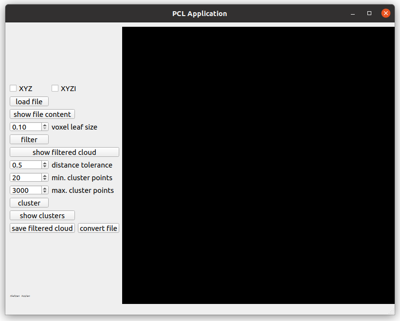
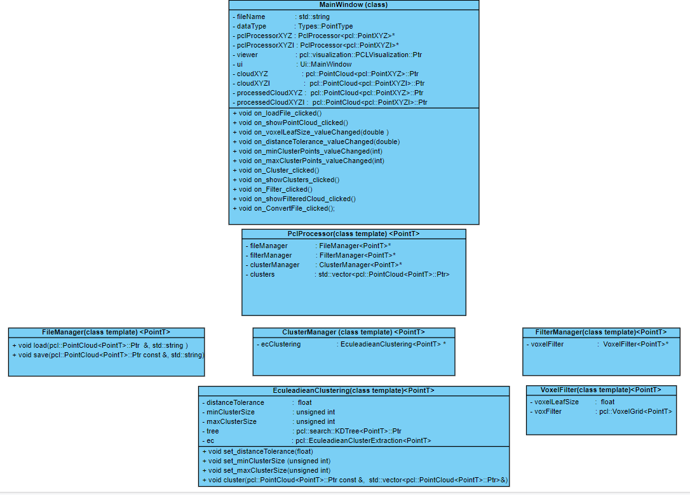

# Simple PCL application
### Functions available
* Load, save and convert files
  * supported extensions: .pcd .txt
* Filtering
  * available algorithms: voxel grid filtering.
* Clustering
  * available algorithms: euclidean clustering.

___
### Application layout
* Check it [here](https://drive.google.com/file/d/1E5WDR_QrXmQEPO-EXV3cmHHyO9Jrx7uP/view?usp=sharing).  *(set the quality to 720p manually)*

___

  
* Templates
  * PclProcessor
    * FileManeger
    * ClusterManager
      * Euclidean
    * FilterManger
      * VoxelFilter

Templates parameter: Point type
___
Future work:
- remove switch and if statements.
- add comments, algorithms, functions  and exception handling
- update layout to accommodate new features
- improve README file and code diagram
